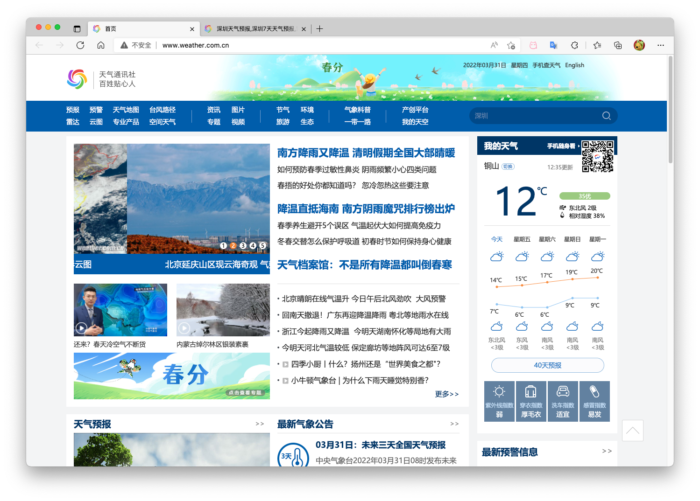
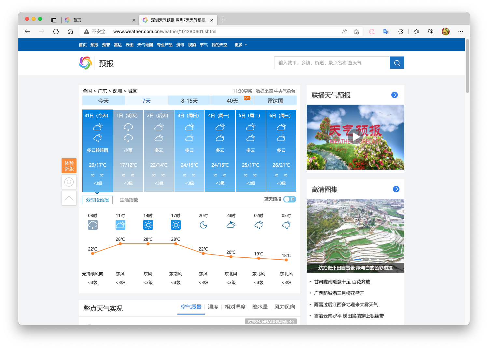
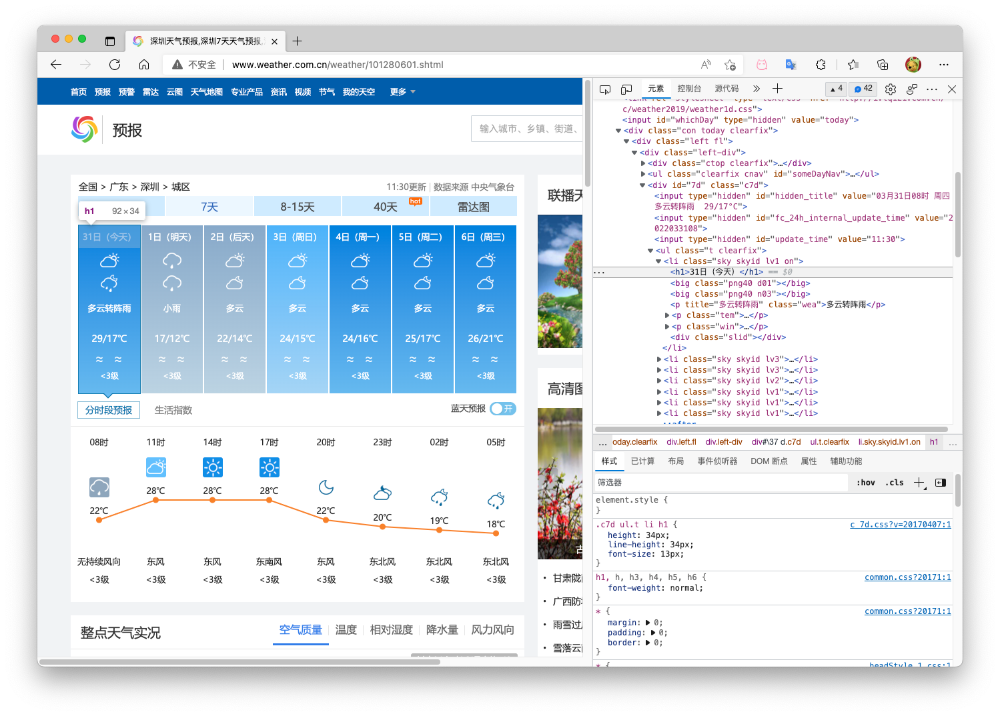

# 2.6 实践项目－爬取天气预报数据

## 2.6.1 项目简介

在 [中国天气网](http://www.weather.com.cn) `http://www.weather.com.cn` 中输入一个城市的名称，例如输入深圳，那么会转到地址 `http://www.weather.com.cn/weather/101280601.shtml` 的 [网页](http://www.weather.com.cn/weather/101280601.shtml) 显示深圳的天气预报，其中 `101280601` 是深圳的代码，每个城市或者地区都有一个代码。如图所示。





我们可以看到深圳 7 天、8-15 天等的天气预报，我们的任务是爬取 7 天的天气预报数据。

## 2.6.2 HTML代码分析

用 Chrome 浏览器浏览网站，鼠标指向 7 天天气预报的今天位置，点击右键弹出菜单，选择“检查”就可以打开这个位置对应的 HTML 代码，如图所示。



选择 `<ul class="t clearfix">` 元素，点击右键弹出菜单选择 `"Edit as HTML"`，就可以进入编辑状态，复制整个 HTML，结果如下：

```html
<ul class="t clearfix">
	<li class="sky skyid lv1 on">
		<h1>31日（今天）</h1>
		<big class="png40 d01"></big>
		<big class="png40 n03"></big>
		<p title="多云转阵雨" class="wea">多云转阵雨</p>
		<p class="tem">
			<span>29</span>/<i>17℃</i>
		</p>
		<p class="win">
			<em>
				<span title="无持续风向" class="NNW"></span>
				<span title="无持续风向" class="NNW"></span>
			</em>
			<i>&lt;3级</i>
		</p>
		<div class="slid"></div>
	</li>
	<li class="sky skyid lv3">
		<h1>1日（明天）</h1>
		<big class="png40 d07"></big>
		<big class="png40 n07"></big>
		<p title="小雨" class="wea">小雨</p>
		<p class="tem">
			<span>17</span>/<i>12℃</i>
		</p>
		<p class="win">
			<em>
				<span title="无持续风向" class="NNW"></span>
				<span title="无持续风向" class="NNW"></span>
			</em>
			<i>&lt;3级</i>
		</p>
		<div class="slid"></div>
	</li>
	<li class="sky skyid lv3">
		<h1>2日（后天）</h1>
		<big class="png40 d01"></big>
		<big class="png40 n01"></big>
		<p title="多云" class="wea">多云</p>
		<p class="tem">
			<span>22</span>/<i>14℃</i>
		</p>
		<p class="win">
			<em>
				<span title="无持续风向" class="NNW"></span>
				<span title="无持续风向" class="NNW"></span>
			</em>
			<i>&lt;3级</i>
		</p>
		<div class="slid"></div>
	</li>
	<li class="sky skyid lv2">
		<h1>3日（周日）</h1>
		<big class="png40 d01"></big>
		<big class="png40 n01"></big>
		<p title="多云" class="wea">多云</p>
		<p class="tem">
			<span>24</span>/<i>15℃</i>
		</p>
		<p class="win">
			<em>
				<span title="无持续风向" class="NNW"></span>
				<span title="无持续风向" class="NNW"></span>
			</em>
			<i>&lt;3级</i>
		</p>
		<div class="slid"></div>
	</li>
	<li class="sky skyid lv1">
		<h1>4日（周一）</h1>
		<big class="png40 d01"></big>
		<big class="png40 n01"></big>
		<p title="多云" class="wea">多云</p>
		<p class="tem">
			<span>24</span>/<i>16℃</i>
		</p>
		<p class="win">
			<em>
				<span title="无持续风向" class="NNW"></span>
				<span title="无持续风向" class="NNW"></span>
			</em>
			<i>&lt;3级</i>
		</p>
		<div class="slid"></div>
	</li>
	<li class="sky skyid lv1">
		<h1>5日（周二）</h1>
		<big class="png40 d01"></big>
		<big class="png40 n01"></big>
		<p title="多云" class="wea">多云</p>
		<p class="tem">
			<span>25</span>/<i>17℃</i>
		</p>
		<p class="win">
			<em>
				<span title="无持续风向" class="NNW"></span>
				<span title="无持续风向" class="NNW"></span>
			</em>
			<i>&lt;3级</i>
		</p>
		<div class="slid"></div>
	</li>
	<li class="sky skyid lv1">
		<h1>6日（周三）</h1>
		<big class="png40 d01"></big>
		<big class="png40 n01"></big>
		<p title="多云" class="wea">多云</p>
		<p class="tem">
			<span>26</span>/<i>21℃</i>
		</p>
		<p class="win">
			<em>
				<span title="无持续风向" class="NNW"></span>
				<span title="无持续风向" class="NNW"></span>
			</em>
			<i>&lt;3级</i>
		</p>
		<div class="slid"></div>
	</li>
</ul>
```

分析这段代码容易发现 7 天的天气预报实际上在一个 `<ul class="t clearfix">` 元素之中，每天是一个 `<li>` 元素，每天的 `<li>` 结构是一样的，因此可以通过 BeautifulSoup 的元素查找方法得到各个元素的值。

## 2.6.3 爬取天气预报数据

通过分析 HTML 代码，我们可以编写爬取的程序爬取深圳 7 天的天气预报数据：

```python
from bs4 import BeautifulSoup
from bs4 import UnicodeDammit
import urllib.request

url = "http://www.weather.com.cn/weather/101280601.shtml"
try:
    headers = {
        "User-Agent": "Mozilla/5.0 (Macintosh; Intel Mac OS X 10_15_7) AppleWebKit/605.1.15 (KHTML, like Gecko) Version/15.4 Safari/605.1.15"}
    req = urllib.request.Request(url, headers=headers)
    data = urllib.request.urlopen(req)
    data = data.read()
    dammit = UnicodeDammit(data, ["utf-8", "gbk"])
    data = dammit.unicode_markup
    soup = BeautifulSoup(data, "lxml")
    lis = soup.select("ul[class='t clearfix'] li")
    for li in lis:
        try:
            date = li.select('h1')[0].text
            weather = li.select('p[class="wea"]')[0].text
            temp = li.select('p[class="tem"] span')[0].text + "/" + li.select('p[class="tem"] i')[0].text
            print(date, weather, temp)
        except Exception as err:
            print(err)
except Exception as err:
    print(err)
```

程序爬取结果：

```
2日（今天） 阵雨转多云 22/13℃
3日（明天） 多云 24/14℃
4日（后天） 多云 25/16℃
5日（周二） 多云 26/17℃
6日（周三） 晴 26/18℃
7日（周四） 晴 27/18℃
8日（周五） 多云转晴 27/20℃
```

由此可见爬取的数据与我们直接从网站看到的是一样的。

## 2.6.4 爬取与存储天气预报数据

我们可以获取北京、上海、广州、深圳等城市的代码，爬取这些城市的天气预报数据，并存储到 sqlite 数据库 `weathers.db` 中，存储的数据表 weathers 是：

```sqlite
create table weathers (wCity varchar(16),wDate varchar(16),wWeather varchar(64),wTemp varchar(32),constraint pk_weather primary key (wCity,wDate))
```

编写程序依次爬取各个城市的天气预报数据存储在数据库中，程序如下：

```python
from bs4 import BeautifulSoup
from bs4 import UnicodeDammit
import urllib.request
import sqlite3


class WeatherDB:
    def openDB(self):
        self.con = sqlite3.connect("weathers.db")
        self.cursor = self.con.cursor()
        try:
            self.cursor.execute(
                "create table weathers (wCity varchar(16),wDate varchar(16),wWeather varchar(64),wTemp varchar(32),constraint pk_weather primary key (wCity,wDate))")
        except:
            self.cursor.execute("delete from weathers")

    def closeDB(self):
        self.con.commit()
        self.con.close()

    def insert(self, city, date, weather, temp):
        try:
            self.cursor.execute("insert into weathers (wCity,wDate,wWeather,wTemp) values (?,?,?,?)",
                                (city, date, weather, temp))
        except Exception as err:
            print(err)

    def show(self):
        self.cursor.execute("select * from weathers")
        rows = self.cursor.fetchall()
        print("%-16s%-16s%-32s%-16s" % ("city", "date", "weather", "temp"))
        for row in rows:
            print("%-16s%-16s%-32s%-16s" % (row[0], row[1], row[2], row[3]))


class WeatherForecast:
    def __init__(self):
        self.headers = {
            "User-Agent": "Mozilla/5.0 (Macintosh; Intel Mac OS X 10_15_7) AppleWebKit/605.1.15 (KHTML, like Gecko) Version/15.4 Safari/605.1.15"}
        self.cityCode = {"北京": "101010100", "上海": "101020100", "广州": "101280101", "深圳": "101280601"}

    def forecastCity(self, city):
        if city not in self.cityCode.keys():
            print(city + " code cannot be found")
            return
        url = "http://www.weather.com.cn/weather/" + self.cityCode[city] + ".shtml"
        try:
            req = urllib.request.Request(url, headers=self.headers)
            data = urllib.request.urlopen(req)
            data = data.read()
            dammit = UnicodeDammit(data, ["utf-8", "gbk"])
            data = dammit.unicode_markup
            soup = BeautifulSoup(data, "lxml")
            lis = soup.select("ul[class='t clearfix'] li")
            for li in lis:
                try:
                    date = li.select('h1')[0].text
                    weather = li.select('p[class="wea"]')[0].text
                    temp = li.select('p[class="tem"] span')[0].text + "/" + li.select('p[class="tem"] i')[0].text
                    print(city, date, weather, temp)
                    self.db.insert(city, date, weather, temp)
                except Exception as err:
                    print(err)
        except Exception as err:
            print(err)

    def process(self, cities):
        self.db = WeatherDB()
        self.db.openDB()
        for city in cities:
            self.forecastCity(city)
        # self.db.show()
        self.db.closeDB()


ws = WeatherForecast()
ws.process(["北京", "上海", "广州", "深圳"])
print("completed")
```

程序执行的效果如下：

```
北京 2日（今天） 晴 19/4℃
北京 3日（明天） 晴 20/7℃
北京 4日（后天） 多云 22/8℃
北京 5日（周二） 晴转多云 24/8℃
北京 6日（周三） 多云转晴 20/8℃
北京 7日（周四） 晴 21/6℃
北京 8日（周五） 晴 22/8℃
上海 2日（今天） 多云转晴 15/8℃
上海 3日（明天） 晴 17/8℃
上海 4日（后天） 多云 18/10℃
上海 5日（周二） 阴 19/12℃
上海 6日（周三） 阴转晴 24/13℃
上海 7日（周四） 阴转晴 25/12℃
上海 8日（周五） 多云转阴 21/12℃
广州 2日（今天） 小雨转多云 14/12℃
广州 3日（明天） 晴 22/11℃
广州 4日（后天） 晴 23/13℃
广州 5日（周二） 晴 24/15℃
广州 6日（周三） 晴 26/16℃
广州 7日（周四） 晴 27/17℃
广州 8日（周五） 阴转晴 30/20℃
深圳 2日（今天） 阵雨转多云 22/13℃
深圳 3日（明天） 多云 24/14℃
深圳 4日（后天） 多云 25/16℃
深圳 5日（周二） 多云 26/17℃
深圳 6日（周三） 晴 26/18℃
深圳 7日（周四） 晴 27/18℃
深圳 8日（周五） 多云转晴 27/20℃
```

