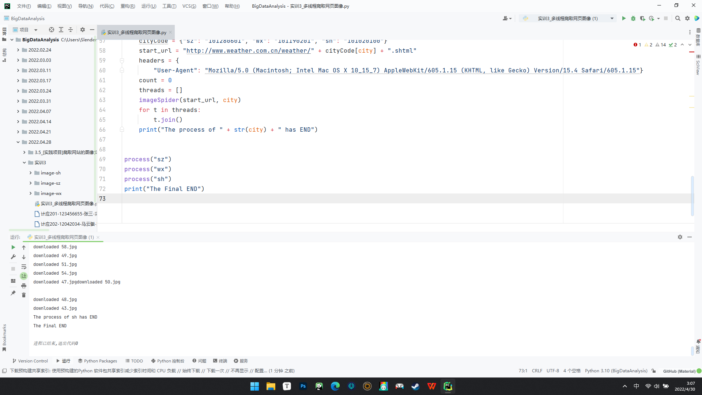
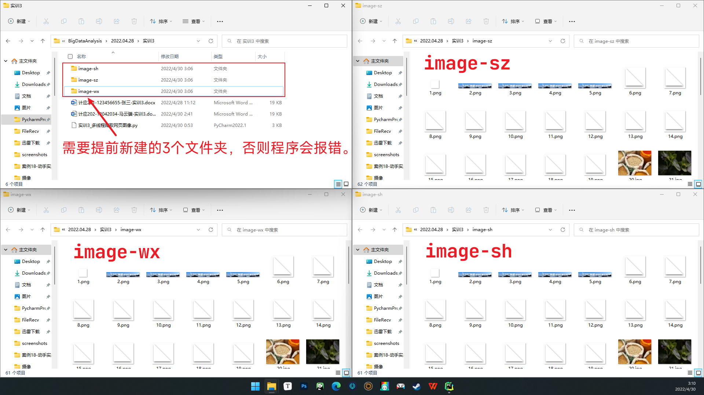

### 过程

程序代码

```python
from bs4 import BeautifulSoup
from bs4 import UnicodeDammit
import urllib.request
import threading


def imageSpider(start_url, city):
    global count
    global threads
    try:
        urls = []
        req = urllib.request.Request(start_url, headers=headers)
        data = urllib.request.urlopen(req)
        data = data.read()
        dammit = UnicodeDammit(data, ["utf-8", "gbk"])
        data = dammit.unicode_markup
        soup = BeautifulSoup(data, "lxml")
        images = soup.select("img")
        for image in images:
            try:
                src = image["src"]
                url = urllib.request.urljoin(start_url, src)
                if url not in urls:
                    print(url)
                    count = count + 1
                    T = threading.Thread(target=download, args=(url, count, city))
                    T.setDaemon(False)
                    T.start()
                    threads.append(T)
            except Exception as err:
                print(err)
    except Exception as err:
        print(err)


def download(url, count, city):
    try:
        if (url[len(url) - 4] == "."):
            ext = url[len(url) - 4:]
        else:
            ext = ""
        req = urllib.request.Request(url, headers=headers)
        data = urllib.request.urlopen(req, timeout=100)
        data = data.read()
        fobj = open("image-" + str(city) + "\\" + str(count) + ext, "wb")
        fobj.write(data)
        fobj.close()
        print("downloaded " + str(count) + ext)
    except Exception as err:
        print(err)


def process(city):
    global headers
    global count
    global threads
    cityCode = {"sz": "101280601", "wx": "101190201", "sh": "101020100"}
    start_url = "http://www.weather.com.cn/weather/" + cityCode[city] + ".shtml"
    headers = {
        "User-Agent": "Mozilla/5.0 (Macintosh; Intel Mac OS X 10_15_7) AppleWebKit/605.1.15 (KHTML, like Gecko) Version/15.4 Safari/605.1.15"}
    count = 0
    threads = []
    imageSpider(start_url, city)
    for t in threads:
        t.join()
    print("The process of " + str(city) + " has END")


process("sz")
process("wx")
process("sh")
print("The Final END")
```

我们需要定义三个函数

- `process()`
  - 通过输入城市缩写，和函数内存放城市代码的数组 `cityCode` 一起定义了需要爬取图片的网站url
  - 定义用户代理 `User-Agent`
  - 调用函数 `imageSpider()` 来爬取图片
- `imageSpider()`
  -  负责爬取目标网站中的图片
  -  调用函数 `download()` 对爬取到的图片进行保存
- `download()`
  - 将爬取到的图片下载下来并存放在相应文件夹中


### 结论

运行程序



可以看到我们爬取到的图片都已存放在了提前新建好的对应文件夹中



需要注意的是，本程序仅且仅能在 Windows 环境下正常运行。

因为 Windows 使用 `\` 作为路径分隔符，而 Linux 和 macOS 使用的是符号 `/` ，如果不对程序源代码进行修改的话，爬取到的图片会错误地以 `image-xx\xx.png` 的命名方式直接存放在程序根目录下。


<center><font color=grey size=2.5>ubuntu 下程序错误运行的效果</font></center>


<center><font color=grey size=2.5>macOS 下程序错误运行的效果</font></center>

解决办法也很简单，只要对第45行代码稍作修改即可。

```python
...
# fobj = open("image-" + str(city) + "\\" + str(count) + ext, "wb")
fobj = open("image-" + str(city) + "//" + str(count) + ext, "wb")
...
```