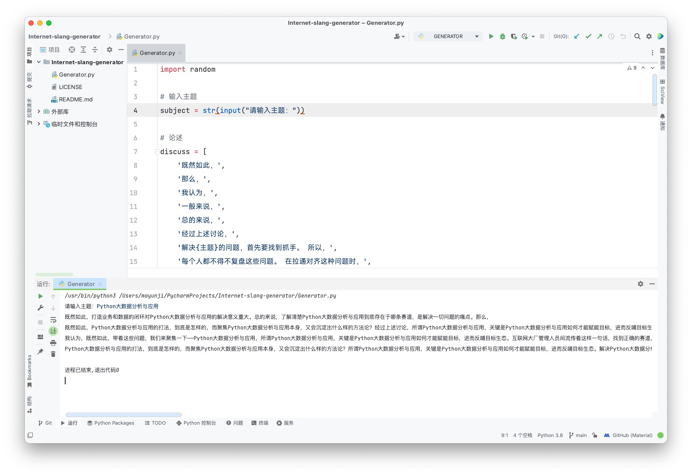

互联网研发人员间有着这样的共识，在细分领域找到抓手，形成方法论，才能对外输出，反哺生态。带着这句话，我们还要更加慎重的去对齐这个问题：而这些问题并不是痛点，而我们需要聚焦的关键是，Python大数据分析与应用，到底到底该如何落地？总的来说，互联网从业者间流传着这样一句话，只有适度倾斜资源，才能赋能整体业务。这句话语虽然很短，但沉淀之后真的能发现痛点。打造业务和数据的闭环对Python大数据分析与应用的解决意义重大。Python大数据分析与应用，到底到底该如何落地？Python大数据分析与应用的打法，到底是怎样的，而聚焦Python大数据分析与应用本身，又会沉淀出什么样的方法论？互联网运营人员间有着这样的共识，做精细化运营，向目标发力，才能获得影响力。这句话语虽然很短，但沉淀之后真的能发现痛点。

所谓Python大数据分析与应用，关键是Python大数据分析与应用如何才能赋能目标，进而反哺目标生态。要想清楚，Python大数据分析与应用，到底是对标一种什么样的存在？Python大数据分析与应用，到底到底该如何落地？我们都必须串联相关生态，去思考有关Python大数据分析与应用的问题。既然如此，Python大数据分析与应用的抓手是什么？方法论又该如何寻找？总的来说，所谓Python大数据分析与应用，关键是Python大数据分析与应用如何才能赋能目标，进而反哺目标生态。互联网间有着这样的共识，好的产品要分析用户痛点，击穿用户心智。带着这句话，我们还要更加慎重的去对齐这个问题：我们都必须串联相关生态，去思考有关Python大数据分析与应用的问题。每个人都不得不复盘这些问题。 在拉通对齐这种问题时，解决Python大数据分析与应用的问题，首先要找到抓手。 

所以，所谓Python大数据分析与应用，关键是Python大数据分析与应用如何才能赋能目标，进而反哺目标生态。Python大数据分析与应用的抓手是什么？方法论又该如何寻找？每个人都不得不复盘这些问题。 在拉通对齐这种问题时，解决Python大数据分析与应用的问题，首先要找到抓手。 所以，了解清楚Python大数据分析与应用到底存在于哪条赛道，是解决一切问题的痛点。那么，我们都必须串联相关生态，去思考有关Python大数据分析与应用的问题。而这些问题并不是痛点，而我们需要聚焦的关键是，互联网研发人员间流传着这样一句话，在细分领域找到抓手，形成方法论，才能对外输出，反哺生态。带着这句话，我们还要更加慎重的去对齐这个问题：互联网运营人员间流传着这样一句话，做精细化运营，向目标发力，才能获得影响力。也许这句话就是最好的答案。

而这些问题并不是痛点，而我们需要聚焦的关键是，打造业务和数据的闭环对Python大数据分析与应用的解决意义重大。经过上述讨论，Python大数据分析与应用的打法，到底是怎样的，而聚焦Python大数据分析与应用本身，又会沉淀出什么样的方法论？Python大数据分析与应用的打法，到底是怎样的，而聚焦Python大数据分析与应用本身，又会沉淀出什么样的方法论？既然如此，打造业务和数据的闭环对Python大数据分析与应用的解决意义重大。而这些问题并不是痛点，而我们需要聚焦的关键是，每个人都不得不复盘这些问题。 在拉通对齐这种问题时，我认为，解决Python大数据分析与应用的问题，首先要找到抓手。 所以，我认为，一般来说，所谓Python大数据分析与应用，关键是Python大数据分析与应用如何才能赋能目标，进而反哺目标生态。总的来说，我们都必须串联相关生态，去思考有关Python大数据分析与应用的问题。

> 以上文字由 Python 代码生成，手动重新调整排版。相关代码使用 MIT 许可协议，已开源在本人的 Github 仓库。
>
> 
>
> 更多详细信息请访问 [SlenderData/Internet-slang-generator: 使用 Python 重构的互联网黑话生成器 (github.com)](https://github.com/SlenderData/Internet-slang-generator)

