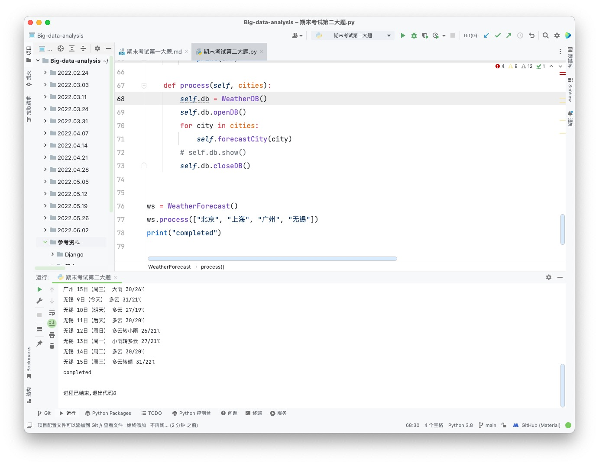

**程序代码**

```python
from bs4 import BeautifulSoup
from bs4 import UnicodeDammit
import urllib.request
import sqlite3


class WeatherDB:
    def openDB(self):
        self.con = sqlite3.connect("weathers.db")
        self.cursor = self.con.cursor()
        try:
            self.cursor.execute(
                "create table weathers (wCity varchar(16),wDate varchar(16),wWeather varchar(64),wTemp varchar(32),constraint pk_weather primary key (wCity,wDate))")
        except:
            self.cursor.execute("delete from weathers")

    def closeDB(self):
        self.con.commit()
        self.con.close()

    def insert(self, city, date, weather, temp):
        try:
            self.cursor.execute("insert into weathers (wCity,wDate,wWeather,wTemp) values (?,?,?,?)",
                                (city, date, weather, temp))
        except Exception as err:
            print(err)

    def show(self):
        self.cursor.execute("select * from weathers")
        rows = self.cursor.fetchall()
        print("%-16s%-16s%-32s%-16s" % ("city", "date", "weather", "temp"))
        for row in rows:
            print("%-16s%-16s%-32s%-16s" % (row[0], row[1], row[2], row[3]))


class WeatherForecast:
    def __init__(self):
        self.headers = {
            "User-Agent": "Mozilla/5.0 (Macintosh; Intel Mac OS X 10_15_7) AppleWebKit/605.1.15 (KHTML, like Gecko) Version/15.4 Safari/605.1.15"}
        self.cityCode = {"北京": "101010100", "上海": "101020100", "广州": "101280101", "无锡": "101190201"}

    def forecastCity(self, city):
        if city not in self.cityCode.keys():
            print(city + " code cannot be found")
            return
        url = "http://www.weather.com.cn/weather/" + self.cityCode[city] + ".shtml"
        try:
            req = urllib.request.Request(url, headers=self.headers)
            data = urllib.request.urlopen(req)
            data = data.read()
            dammit = UnicodeDammit(data, ["utf-8", "gbk"])
            data = dammit.unicode_markup
            soup = BeautifulSoup(data, "lxml")
            lis = soup.select("ul[class='t clearfix'] li")
            for li in lis:
                try:
                    date = li.select('h1')[0].text
                    weather = li.select('p[class="wea"]')[0].text
                    temp = li.select('p[class="tem"] span')[0].text + "/" + li.select('p[class="tem"] i')[0].text
                    print(city, date, weather, temp)
                    self.db.insert(city, date, weather, temp)
                except Exception as err:
                    print(err)
        except Exception as err:
            print(err)

    def process(self, cities):
        self.db = WeatherDB()
        self.db.openDB()
        for city in cities:
            self.forecastCity(city)
        # self.db.show()
        self.db.closeDB()


ws = WeatherForecast()
ws.process(["北京", "上海", "广州", "无锡"])
print("completed")
```

**运行结果**

```
北京 9日（今天） 多云 27/18℃
北京 10日（明天） 小雨 29/19℃
北京 11日（后天） 小雨 29/19℃
北京 12日（周日） 阴转小雨 26/17℃
北京 13日（周一） 多云转阴 26/16℃
北京 14日（周二） 阴转多云 26/17℃
北京 15日（周三） 多云 27/17℃
上海 9日（今天） 晴转阴 28/21℃
上海 10日（明天） 中雨转阴 24/20℃
上海 11日（后天） 多云转阴 26/20℃
上海 12日（周日） 阴转大雨 26/21℃
上海 13日（周一） 小雨转阴 27/20℃
上海 14日（周二） 阴 27/21℃
上海 15日（周三） 阴 30/22℃
广州 9日（今天） 中雨转雷阵雨 30/24℃
广州 10日（明天） 中雨 30/25℃
广州 11日（后天） 中雨转雷阵雨 30/25℃
广州 12日（周日） 中雨转雷阵雨 32/26℃
广州 13日（周一） 雷阵雨转大雨 32/24℃
广州 14日（周二） 大雨 29/23℃
广州 15日（周三） 大雨 30/26℃
无锡 9日（今天） 多云 31/21℃
无锡 10日（明天） 多云 27/19℃
无锡 11日（后天） 多云 30/20℃
无锡 12日（周日） 多云转小雨 26/21℃
无锡 13日（周一） 小雨转多云 27/21℃
无锡 14日（周二） 多云 30/20℃
无锡 15日（周三） 多云转晴 31/22℃
completed

进程已结束,退出代码0
```

**结果截屏**


